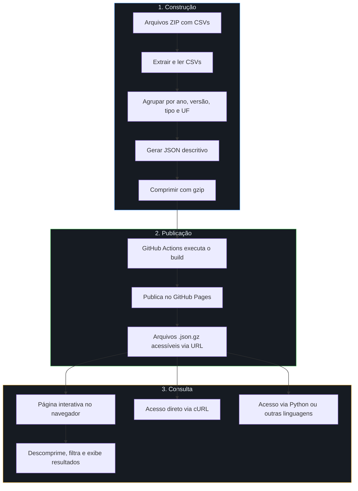
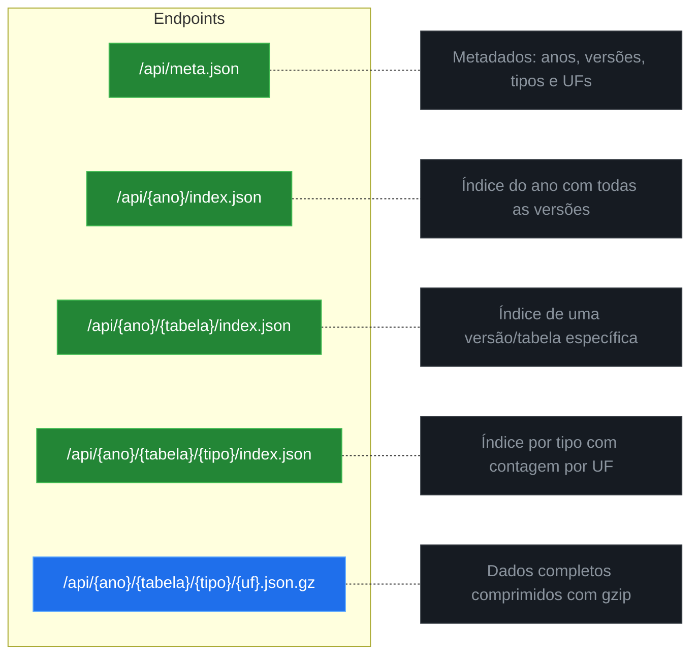
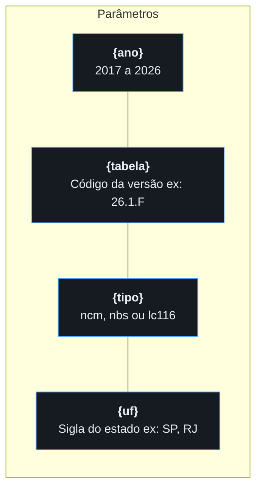
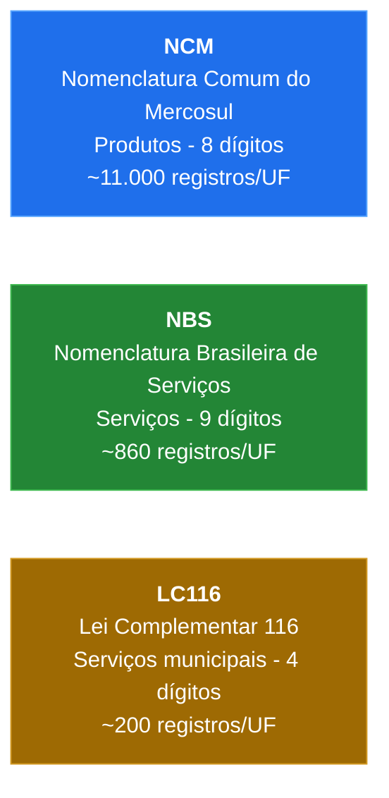
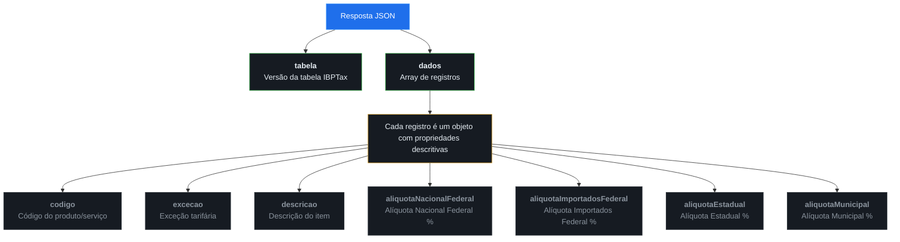
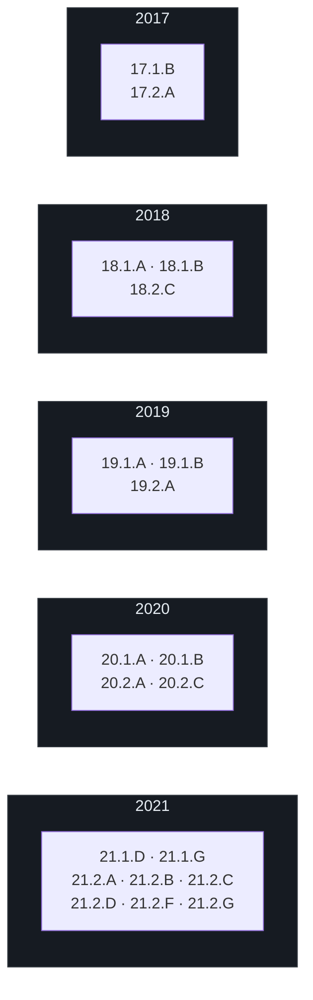
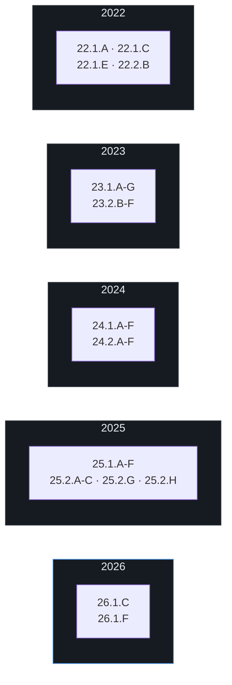

> **AVISO:** Os dados contidos neste repositório **não são atualizados em tempo real**. As tabelas são utilizadas apenas para **consulta histórica** e **não é recomendado o uso em sistemas reais de produção**, apesar dos documentos contidos no repositório serem tabelas oficiais publicadas pelo IBPT (Instituto Brasileiro de Planejamento e Tributação).

# Repositório de Tabelas IBPT - API Estática

Repositório destinado ao armazenamento e versionamento das **Tabelas IBPTax** (Instituto Brasileiro de Planejamento e Tributação). Essas tabelas contêm as alíquotas aproximadas dos tributos incidentes sobre produtos e serviços, conforme a Lei da Transparência Fiscal (Lei 12.741/2012).

Este repositório disponibiliza uma **API estática via GitHub Pages** para consulta das alíquotas tributárias, com **todas as versões/tabelas** de cada ano (1º e 2º semestre, revisões A, B, C, etc.).

---

## Como Funciona o Sistema

O sistema funciona em 3 etapas: **construção**, **publicação** e **consulta**.



1. **Construção:** Os arquivos ZIP contendo CSVs do IBPT são extraídos, lidos e agrupados por ano, versão/tabela, tipo (NCM, NBS, LC116) e UF. Os dados são convertidos para JSON com propriedades descritivas e comprimidos com gzip.

2. **Publicação:** A cada push no repositório, o GitHub Actions executa o build automaticamente e publica os arquivos no GitHub Pages. Os dados ficam acessíveis como URLs estáticas.

3. **Consulta:** O usuário pode consultar de duas formas:
   - **Página interativa:** Filtros por ano, versão, UF, tipo, código e descrição. A página baixa os arquivos comprimidos, descomprime no navegador e exibe os resultados em tabela paginada com opção de exportar CSV.
   - **Acesso direto:** Qualquer aplicação pode acessar os endpoints e descomprimir os dados com a ferramenta de sua preferência.

### Compressão

Os dados originais somam ~1.7 GB. Para viabilizar a hospedagem, todos os arquivos de dados são comprimidos com gzip, reduzindo para ~314 MB (82% de redução).

- Arquivos de dados usam extensão `.json.gz` (comprimidos)
- Arquivos de índice usam extensão `.json` (sem compressão)
- No navegador, a descompressão é automática e nativa (Chrome 80+, Firefox 113+, Safari 16.4+)
- Via terminal: `curl URL | gunzip`
- Via Python: `gzip.decompress(resposta.content)`

### Pesquisa

A pesquisa na página interativa é inteiramente **client-side** — não existe backend.

1. Ao abrir a página, os metadados são carregados e os filtros são populados (anos, versões, UFs, tipos).
2. Ao consultar, a página monta as combinações necessárias com base nos filtros selecionados. Filtros vazios incluem todas as opções.
3. Os arquivos comprimidos são baixados em lotes paralelos, descomprimidos no navegador e filtrados por código e/ou descrição.
4. Os resultados são exibidos em tabela paginada, ordenável por qualquer coluna, com opção de exportar CSV.

Quanto mais filtros você selecionar, mais rápida será a consulta. Uma busca com ano + versão + tipo + UF específicos baixa apenas 1 arquivo (~190 KB).

---

## Página de Consulta

Acesse a página de consulta interativa:

> **[Acessar Consulta](https://luizinhoh2o1.github.io/tabelas-ibpt/)**

---

## API - Endpoints

### Base URL

```
https://luizinhoh2o1.github.io/tabelas-ibpt/api
```

### Endpoints Disponíveis



> Endpoints verdes retornam JSON simples. O endpoint azul retorna dados comprimidos com gzip (`.json.gz`).

### Parâmetros



### Tipos de Dados



---

## Formato de Resposta

Os endpoints de dados (`.json.gz`) retornam JSON com propriedades descritivas comprimido com gzip:

```json
{
  "tabela": "26.1.F",
  "dados": [
    {
      "codigo": "01012100",
      "excecao": "",
      "descricao": "Cavalos reprodutores,de raca pura",
      "aliquotaNacionalFederal": 13.45,
      "aliquotaImportadosFederal": 15.45,
      "aliquotaEstadual": 18.00,
      "aliquotaMunicipal": 0.00
    }
  ]
}
```

### Estrutura do JSON



---

## Versões Disponíveis

Todas as versões/tabelas de cada ano são processadas e disponibilizadas:





UFs: `AC` `AL` `AM` `AP` `BA` `CE` `DF` `ES` `GO` `MA` `MG` `MS` `MT` `PA` `PB` `PE` `PI` `PR` `RJ` `RN` `RO` `RR` `RS` `SC` `SE` `SP` `TO`

---

## Build Local

Requisitos: Node.js >= 22 (LTS)

```bash
npm install
npm run construir
```

Os arquivos serão gerados em `docs/api/`.

---

## Deploy

O deploy é automático via **GitHub Actions**. A cada push na branch `main`/`master`, o workflow executa o build e publica no GitHub Pages.

Para configurar:
1. Vá em **Settings > Pages** no repositório
2. Em **Source**, selecione **GitHub Actions**
3. Faça push na branch principal

---

## Licença

Este projeto está licenciado sob os termos do arquivo [LICENSE](LICENSE) (Apache 2.0).

O código fonte é de **uso livre**: qualquer pessoa pode baixar, modificar, distribuir e comercializar sem restrições.
