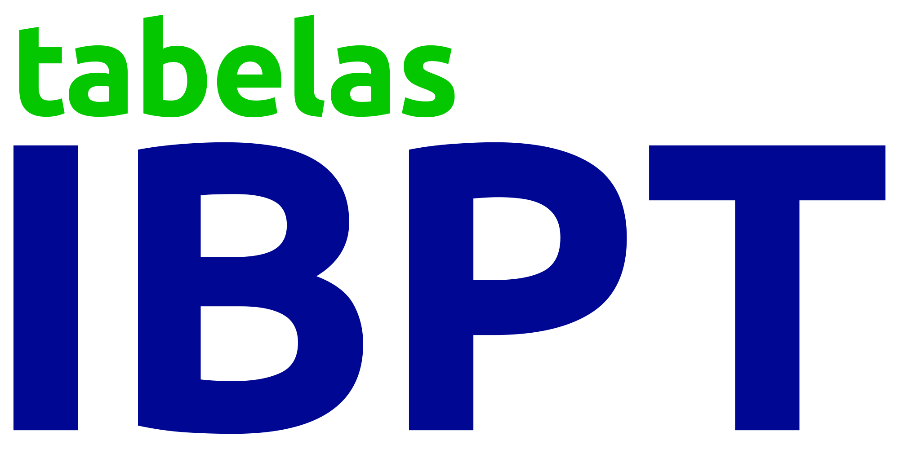

<p align="center">
  
</p>

<p align="center">
  API estática das Tabelas IBPTax, hospedada no GitHub Pages.<br>
  Sem cadastro, sem token, sem backend.
</p>

<p align="center">
  <a href="https://ibpt.valraw.com.br/"><strong>Consultar no navegador</strong></a>
</p>

---

As Tabelas IBPTax, publicadas pelo Instituto Brasileiro de Planejamento e Tributação, trazem a carga tributária aproximada de produtos e serviços exigida pela Lei da Transparência Fiscal (Lei 12.741/2012). O IBPT distribui essas tabelas como arquivos ZIP semestrais, um CSV por estado, e não oferece um histórico consolidado.

Este repositório arquiva esses ZIPs desde 2015 e os converte em endpoints JSON estáticos, servidos pelo GitHub Pages. São 100 tabelas, 32,3 milhões de registros e todas as 27 UFs.

> **Atenção:** os dados aqui não são atualizados em tempo real. As tabelas são as oficiais publicadas pelo IBPT, mas a atualização deste repositório é manual. Confira a vigência antes de usar em produção.

## Consulta rápida

Os arquivos de dados são servidos como gzip puro, sem `Content-Encoding`, então o cliente precisa descomprimir por conta própria. Os exemplos abaixo buscam a tabela de NCM de São Paulo na versão 26.2.A.

**Linux, macOS ou WSL**

```bash
url=https://ibpt.valraw.com.br/api/2026/26.2.A/ncm/SP.json.gz

# Primeiro registro
curl -s "$url" | gunzip | jq '.dados[0]'

# Todos os códigos que começam com 0101
curl -s "$url" | gunzip | jq -c '.dados[] | select(.codigo | startswith("0101"))'

# Salvar a tabela descomprimida
curl -s "$url" | gunzip > ncm-sp-26.2.A.json
```

Sem `jq`, use `python3 -m json.tool` para formatar a saída.

**Windows (PowerShell 5.1 ou 7+)**

```powershell
$url = 'https://ibpt.valraw.com.br/api/2026/26.2.A/ncm/SP.json.gz'

$gz = [IO.Compression.GZipStream]::new(
    [IO.MemoryStream]::new((Invoke-WebRequest $url).Content),
    [IO.Compression.CompressionMode]::Decompress)
$tabela = ([IO.StreamReader]::new($gz)).ReadToEnd() | ConvertFrom-Json

# Primeiro registro
$tabela.dados[0]

# Todos os códigos que começam com 0101
$tabela.dados | Where-Object codigo -like '0101*' |
    Format-Table codigo, descricao, aliquotaEstadual

# Salvar a tabela descomprimida
$tabela | ConvertTo-Json -Depth 5 | Set-Content ncm-sp-26.2.A.json -Encoding utf8
```

`Invoke-WebRequest` não descomprime sozinho porque a resposta não declara `Content-Encoding: gzip`; daí o `GZipStream` explícito.

**Python**

```python
import gzip, json, urllib.request

url = "https://ibpt.valraw.com.br/api/2026/26.2.A/ncm/SP.json.gz"
tabela = json.loads(gzip.decompress(urllib.request.urlopen(url).read()))

for item in tabela["dados"][:5]:
    print(item["codigo"], item["descricao"], item["aliquotaNacionalFederal"])
```

**Navegador**

A descompressão é nativa, sem biblioteca:

```js
const resp = await fetch('https://ibpt.valraw.com.br/api/2026/26.2.A/ncm/SP.json.gz');
const fluxo = resp.body.pipeThrough(new DecompressionStream('gzip'));
const { dados } = await new Response(fluxo).json();
```

## Endpoints

Base: `https://ibpt.valraw.com.br/api`

| Endpoint | Retorno |
|---|---|
| `/meta.json` | Anos, versões, tipos, UFs e estatísticas do último build |
| `/{ano}/index.json` | Versões publicadas naquele ano |
| `/{ano}/{tabela}/index.json` | Contagem de registros por tipo e UF |
| `/{ano}/{tabela}/{tipo}/index.json` | Contagem por UF de um tipo |
| `/{ano}/{tabela}/{tipo}/{uf}.json.gz` | Os registros (gzip) |
| `/todos-{ano}.csv.gz` | Todos os registros de um ano em CSV (gzip) |

Os índices são JSON puro; os dados vêm comprimidos. Um arquivo típico de NCM tem 211 KB comprimidos.

| Parâmetro | Valores | Exemplo |
|---|---|---|
| `{ano}` | 2015 a 2026 | `2026` |
| `{tabela}` | Código da versão | `26.2.A` |
| `{tipo}` | `ncm`, `nbs`, `lc116` | `ncm` |
| `{uf}` | As 27 siglas | `SP` |

Rotas sem extensão (`/api/2026/26.2.A/ncm/SP`) são interceptadas pelo `404.html`, que descomprime e exibe o JSON formatado no navegador. Prático para inspecionar, não para consumir por código.

### Tipos de tabela

| Tipo | Nome | Conteúdo | Registros por UF |
|---|---|---|---|
| `ncm` | Nomenclatura Comum do Mercosul | Produtos, código de 8 dígitos | ~10.900 |
| `nbs` | Nomenclatura Brasileira de Serviços | Serviços, 9 dígitos | ~860 |
| `lc116` | Lei Complementar 116 | Serviços municipais, 4 dígitos | ~200 |

## Formato

```json
{
  "tabela": "26.2.A",
  "dados": [
    {
      "codigo": "01012100",
      "excecao": "",
      "descricao": "Cavalos reprodutores,de raca pura",
      "aliquotaNacionalFederal": 13.45,
      "aliquotaImportadosFederal": 15.45,
      "aliquotaEstadual": 18.00,
      "aliquotaMunicipal": 0.00,
      "vigenciaInicio": "20/08/2026",
      "vigenciaFim": "30/09/2026"
    }
  ]
}
```

| Campo | Tipo | Descrição |
|---|---|---|
| `codigo` | string | Código NCM, NBS ou LC116 |
| `excecao` | string | Exceção tarifária, quando houver |
| `descricao` | string | Descrição do produto ou serviço |
| `aliquotaNacionalFederal` | number | Tributos federais sobre itens nacionais, em % |
| `aliquotaImportadosFederal` | number | Tributos federais sobre itens importados, em % |
| `aliquotaEstadual` | number | ICMS e demais tributos estaduais, em % |
| `aliquotaMunicipal` | number | ISS e demais tributos municipais, em % |
| `vigenciaInicio` | string | Início da vigência, `dd/mm/aaaa` |
| `vigenciaFim` | string | Fim da vigência, `dd/mm/aaaa` |

As alíquotas usam ponto como separador decimal. O CSV consolidado usa ponto e vírgula como separador de campo e acrescenta quatro colunas na frente: `ano`, `tabela`, `tipo` e `uf`.

## Como funciona

O build lê os ZIPs em `repositorio-ibpt/`, extrai os CSVs, converte cada combinação de ano, versão, tipo e UF em um JSON comprimido, e monta os índices. O GitHub Actions roda isso a cada push na branch principal e publica `docs/` no Pages.

Os CSVs originais somam 4,55 GB. Depois do gzip nível 9, a API publicada ocupa 1,1 GB em 8.496 arquivos, uma redução de 76%. Os CSVs do IBPT vêm em latin1 e são lidos por streaming, linha a linha, para o build não carregar tudo na memória.

A página de consulta roda inteiramente no navegador. Ela carrega o `meta.json` para montar os filtros e depois busca só os arquivos que a combinação escolhida exige, em lotes de 8 requisições paralelas. Quanto mais específico o filtro, menos dados trafegam: ano, versão, tipo e UF definidos baixam um único arquivo de 211 KB.

Consultas amplas seguem outro caminho. Acima de 50 arquivos, a página passa a usar os CSVs consolidados por ano e os lê por streaming, descartando as linhas que não casam com o filtro sem acumular nada em memória. Com filtro de ano, é um arquivo só.

## Versões disponíveis

| Ano | Versões | Qtd |
|---|---|---|
| 2015 | 15.1.B, 15.2.A | 2 |
| 2016 | 16.1.A, 16.2.A, 16.2.B | 3 |
| 2017 | 17.1.A, 17.1.B, 17.2.A, 17.2.B | 4 |
| 2018 | 18.1.A, 18.1.B, 18.2.A, 18.2.B, 18.2.C | 5 |
| 2019 | 19.1.A, 19.1.B, 19.2.A, 19.2.B | 4 |
| 2020 | 20.1.A, 20.1.B, 20.2.A, 20.2.B, 20.2.C | 5 |
| 2021 | 21.1.A–I, 21.2.A–G | 16 |
| 2022 | 22.1.A–G, 22.2.A–G | 14 |
| 2023 | 23.1.A–G, 23.2.A–F | 13 |
| 2024 | 24.1.A–F, 24.2.A–F | 12 |
| 2025 | 25.1.A–F, 25.2.A–H | 14 |
| 2026 | 26.1.C, 26.1.E, 26.1.F, 26.1.G, 26.1.H, 26.1.K, 26.1.L, 26.2.A | 8 |
| **Total** | | **100** |

As tabelas de 2015 e 2016 foram recuperadas do histórico do Projeto ACBr, já que o portal do IBPT não disponibiliza versões antigas. UFs cobertas: AC, AL, AM, AP, BA, CE, DF, ES, GO, MA, MG, MS, MT, PA, PB, PE, PI, PR, RJ, RN, RO, RR, RS, SC, SE, SP, TO.

## Rodando localmente

Requer Node.js 22 ou superior.

```bash
npm install
npm test                     # testes do parser CSV
npm run build                # build incremental
npm run build -- --completo  # ignora o cache e reconstrói tudo
```

A saída vai para `docs/api/`, que está no `.gitignore` e nunca deve ser commitada.

O build é incremental por ano. O arquivo `docs/api/_manifesto.json` guarda o hash dos ZIPs de cada ano e os totais do último build; um ano cujos ZIPs não mudaram é reaproveitado inteiro. Um build do zero leva alguns minutos, um build sem alterações leva poucos segundos.

Para adicionar uma tabela nova, coloque o ZIP em `repositorio-ibpt/` seguindo o padrão `TabelaIBPTax_{versão}.zip` e rode o build. Os CSVs precisam estar no arquivo; se um ZIP não produzir dados, o build avisa quais foram e termina com erro, em vez de publicar uma API incompleta em silêncio.

## Estrutura

```
src/
  construir.ts       Orquestra o build e o cache incremental
  processadorCsv.ts  Parser CSV por streaming, em latin1
  geradorJson.ts     Escrita dos JSON, índices e CSVs comprimidos
  constantes.ts      UFs e tipos de tabela
  tipos.ts           Interfaces TypeScript
docs/
  index.html         Página de consulta
  404.html           Intercepta rotas sem extensão
  public/            Logo e favicons
  api/               Gerado pelo build (gitignored)
repositorio-ibpt/    ZIPs originais do IBPT
```

## Deploy

O deploy é automático. Cada push na branch principal dispara o workflow em `.github/workflows/deploy.yml`, que roda os testes, executa o build e publica no GitHub Pages.

Para configurar em um fork: em **Settings > Pages**, selecione **GitHub Actions** como origem e faça push na branch principal.

## Claude Code

O repositório traz configuração para o [Claude Code](https://claude.com/claude-code). O `CLAUDE.md` documenta estrutura, convenções e armadilhas conhecidas do build; `.claude/rules/` guarda as regras de nomenclatura e os padrões de código. As duas coisas são carregadas automaticamente ao abrir o projeto.

## Licença

Código sob [Apache 2.0](LICENSE): livre para usar, modificar, distribuir e comercializar.

Os dados são de autoria do [IBPT](https://ibpt.com.br) / empresometro.com.br e seguem os termos do instituto.

<details>
<summary>Termos relacionados</summary>

Tabela IBPT, TabelaIBPTax, IBPT histórico, alíquota IBPT, IBPT NCM, IBPT NBS, IBPT LC116, tabela de impostos Brasil, De Olho no Imposto, Lei 12.741, valor aproximado de tributos, carga tributária NCM, alíquota federal nacional, alíquota federal importado, alíquota estadual, alíquota municipal, IBPT 2015, IBPT 2016, IBPT 2017, IBPT 2018, IBPT 2019, IBPT 2020, IBPT 2021, IBPT 2022, IBPT 2023, IBPT 2024, IBPT 2025, IBPT 2026, versões IBPT, histórico IBPT, auditoria fiscal NF-e, auditoria retroativa tributária, recuperação de créditos tributários, nota fiscal eletrônica impostos, NF-e tributos, NFC-e IBPT, ERP fiscal Brasil, Simples Nacional alíquota, NCM impostos, NCM alíquota, classificação fiscal NCM, ibpt.valraw.com.br, VALRAW, API IBPT, API fiscal brasileira, API NCM, API tributária, tabela IBPT JSON, tabela IBPT CSV, tabela IBPT open source, tabela IBPT gratuita, IBPT API estática, IBPT GitHub Pages, IBPT sem cadastro, IBPT sem token, IBPT todas as versões, IBPT semestral, IBPT vigência, IBPT revisões A B C, deolhonoimposto, iws.ibpt.org.br, apidoni.ibpt.org.br, imposto nota fiscal consumidor, transparência tributária, Lei de Transparência Fiscal

</details>
